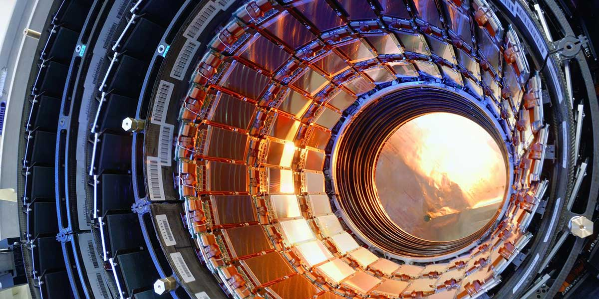

# Física Experimental V

Dados e análises feitas para os experimentos do laboratório de Física Moderna da disciplina de Física Experimental V no Instituto de Física da USP.

- **Experimento 1** - Emissão e Absorção de Raios-X
- **Experimento 2** - Estudo do Efeito Fotoelétrico
- **Experimento 3** - Excitação Eletrônica e Ionização do Hg
- **Experimento 4** - Espectroscopia
